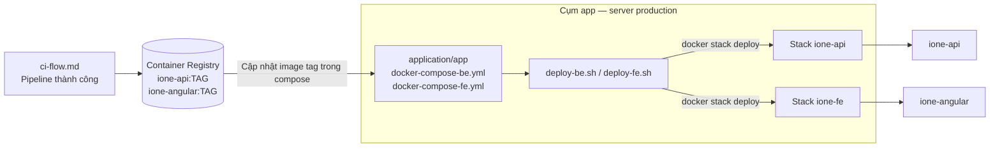

# CD Flow — iOne Core

> **Liên quan:** Build image trên GitLab CI được mô tả tại [ci-flow.md](./ci-flow.md).

## 1. Mục đích tài liệu

Tài liệu này mô tả quy trình **Continuous Delivery / Deploy (CD)** của dự án **iOne Core**, gồm:

- Luồng đưa Docker image từ registry lên **cụm app production**.
- Manifest deploy (Docker Compose) và script khởi động trên server.
- Quy tắc khi nào và ai thực hiện deploy.

**Phạm vi CD:**

| Trên server production (CD) | Trong GitLab CI (xem [ci-flow.md](./ci-flow.md)) |
|---|---|
| Cập nhật manifest + chạy script deploy | Build & push image |
| `docker stack deploy` qua Docker Compose | Build artifact |
| Cấu hình biến môi trường runtime | Cache dependency |

**Nguồn manifest & script deploy (tham chiếu):**

Repo **[ione-infrastructure](https://git.ibds.com.vn/ione/ione-infrastructure.git)** — thư mục `application/app/`:

| File | Vai trò |
|---|---|
| `docker-compose-be.yml` | Manifest Docker Compose / Swarm cho **Backend** (`ione-api`) |
| `docker-compose-fe.yml` | Manifest Docker Compose / Swarm cho **Frontend** (`ione-angular`) |
| `deploy-be.sh` | Script khởi động / cập nhật stack BE |
| `deploy-fe.sh` | Script khởi động / cập nhật stack FE |
| `create-network.sh` | Tạo overlay network `ione-network` (chạy một lần khi init) |

Trên **server production (cụm app)**, các file trên được đặt sẵn tại thư mục deploy (clone/pull từ repo `ione-infrastructure`). Admin SSH vào server và chạy script tại đó — **không** deploy trực tiếp từ repo `ione-core`.

---

## 2. Luồng CD (demonstration flow)

### 2.1. Tổng quan

CD **không nằm trong GitLab pipeline**. Sau khi CI push image thành công:

```
CI push image  →  Cập nhật tag trong compose (trên server)  →  chạy deploy-*.sh  →  docker stack deploy
```

Image tag theo **thời gian build** (format `yyyyMMddHHmmss`), sinh trong job docker CI.

### 2.2. Sơ đồ luồng



### 2.3. Manifest trên server (`application/app`)

BE và FE **tách stack riêng**, mỗi phần có file Docker Compose và script deploy tương ứng.

**Backend — `docker-compose-be.yml`**

- Service: `ione-api`
- Image: `registry.vnexco.com/ione-api:<TAG>` (cập nhật tag sau mỗi lần CI BE)
- Port: `8081:80`, `8443:443`
- Network: `ione-network` (overlay)
- Env: DB, MinIO, CORS, Auth, Firebase, Elsa, …
- Deploy: 2 replicas, rolling update

**Frontend — `docker-compose-fe.yml`**

- Service: `ione-angular`
- Image: `registry.vnexco.com/ione-angular:<TAG>` (cập nhật tag sau mỗi lần CI FE)
- Port: `80:80`
- Network: `ione-network` (overlay)
- Deploy: 2 replicas, rolling update

**Script khởi động:**

```bash
# deploy-be.sh
docker stack deploy -c docker-compose-be.yml ione-api --with-registry-auth

# deploy-fe.sh
docker stack deploy -c docker-compose-fe.yml ione-fe --with-registry-auth

# create-network.sh (init một lần)
docker network create --driver overlay --attachable ione-network
```

### 2.4. Các bước deploy chi tiết

**Điều kiện tiên quyết:**

- Job docker CI tương ứng **passed** (`docker:build:api` hoặc `docker:build:angular`).
- Server đã join **Docker Swarm** (manager node).
- Overlay network `ione-network` đã tạo (`create-network.sh`).
- Đã login registry trên server (`docker login registry.vnexco.com` hoặc registry GitLab tùy nơi push image).

**Deploy Backend:**

1. Lấy `DOCKER_IMAGE_TAG` từ log job `docker:build:api` (vd. `20260722181630`).
2. SSH vào **cụm app production**, vào thư mục `application/app`.
3. Sửa `docker-compose-be.yml` — cập nhật dòng `image:` với tag mới.
4. Chạy:

```bash
./deploy-be.sh
```

**Deploy Frontend:**

1. Lấy `DOCKER_IMAGE_TAG` từ log job `docker:build:angular`.
2. SSH vào server, thư mục `application/app`.
3. Sửa `docker-compose-fe.yml` — cập nhật dòng `image:` với tag mới.
4. Chạy:

```bash
./deploy-fe.sh
```

**Kiểm tra sau deploy:**

```bash
docker stack services ione-api
docker stack services ione-fe
docker service ps ione-api_ione-api
docker service ps ione-fe_ione-angular
```

---

## 3. Quy tắc kích hoạt (Trigger rules)

### 3.1. Khi nào deploy?

| Sự kiện | Hành động CD trên server |
|---|---|
| CI BE pass | Cập nhật tag trong `docker-compose-be.yml` → `./deploy-be.sh` |
| CI FE pass (sau BE đã deploy nếu đổi API) | Cập nhật tag trong `docker-compose-fe.yml` → `./deploy-fe.sh` |
| Push `main` + CI pass | **Không tự deploy** — admin SSH và chạy script trên cụm app |
| Rollback | Sửa compose về tag datetime cũ → chạy lại `deploy-be.sh` / `deploy-fe.sh` |

### 3.2. Ai thực hiện?

- Deploy production: **admin / DevOps** SSH vào **cụm app** trên server production.
- Developer: đảm bảo CI pass, gửi `DOCKER_IMAGE_TAG` (BE/FE) cho người deploy.

### 3.3. Tag image

**Định dạng:** `yyyyMMddHHmmss` (sinh trong job docker CI)

| Image | Job CI | Manifest trên server |
|---|---|---|
| `ione-api:<TAG>` | `docker:build:api` | `docker-compose-be.yml` → field `image` |
| `ione-angular:<TAG>` | `docker:build:angular` | `docker-compose-fe.yml` → field `image` |

**Cách lấy tag:** GitLab → pipeline → job docker → log `DOCKER_IMAGE_TAG=20260722181630`.

BE và FE **thường có tag khác nhau** — deploy riêng qua `deploy-be.sh` / `deploy-fe.sh`, không bắt buộc cùng một tag.

### 3.4. Biến môi trường runtime

Biến App/DB/MinIO/CORS… khai báo trong `docker-compose-be.yml` (section `environment`), hỗ trợ override qua env trước khi `stack deploy`:

```bash
export DB_CONNECTION_STRING="Host=...;..."
export MINIO_ACCESS_KEY="..."
./deploy-be.sh
```

Chi tiết danh sách biến: xem file manifest trong repo `ione-infrastructure/application/app/`.

---

## 4. Cách sử dụng và phát triển tiếp

### 4.1. Quy trình deploy sau CI

**Khi đổi API backend:**

1. CI BE pass → copy tag BE.
2. SSH cụm app → cập nhật `docker-compose-be.yml` → `./deploy-be.sh`.
3. CI FE pass (retry sau khi BE live) → copy tag FE.
4. Cập nhật `docker-compose-fe.yml` → `./deploy-fe.sh`.
5. Smoke test `https://api.ibds.com.vn` và `https://ione.ibds.com.vn`.

**Khi chỉ đổi FE:**

1. CI FE pass → copy tag FE.
2. Cập nhật `docker-compose-fe.yml` → `./deploy-fe.sh`.

### 4.2. Rollback

Sửa manifest về tag ổn định trước đó, rồi chạy lại script tương ứng:

```bash
# Ví dụ rollback BE
# docker-compose-be.yml → image: registry.vnexco.com/ione-api:20260720143000
./deploy-be.sh
```

Ghi chú tag đã deploy thành công để rollback nhanh.

### 4.3. Xử lý lỗi CD thường gặp

| Lỗi | Nguyên nhân | Cách xử lý |
|---|---|---|
| Pull image failed | Tag sai / chưa push registry | Kiểm tra log CI và tag trên registry |
| Stack deploy failed | Swarm chưa active | `docker info`, init/join Swarm |
| Service restart loop | Sai env / DB / cert | `docker service logs ione-api_ione-api` |
| Network not found | Chưa tạo `ione-network` | Chạy `./create-network.sh` |
| FE proxy lệch API | Deploy FE trước BE mới | Deploy BE trước, retry CI FE ([ci-flow.md §2.4](./ci-flow.md)) |

### 4.4. Hướng phát triển CD tiếp theo

1. Script tự động cập nhật tag trong compose từ tham số (tránh sửa tay YAML).
2. GitLab job `deploy:production` manual, SSH remote chạy `deploy-*.sh`.
3. GitOps: manifest trong `ione-infrastructure` sync tự động lên server.
4. Health check sau `stack deploy` (`/health-status`).
5. Secret manager cho DB/MinIO thay vì env trong compose.

### 4.5. Checklist trước khi deploy production

- [ ] CI job docker **passed**, đã có `DOCKER_IMAGE_TAG`
- [ ] Đang SSH đúng **cụm app**, đúng thư mục `application/app`
- [ ] Đã cập nhật tag trong `docker-compose-be.yml` và/hoặc `docker-compose-fe.yml`
- [ ] Có kế hoạch rollback (tag cũ)
- [ ] Sau deploy: `docker stack services` + smoke test

---

## Phụ lục — Cấu trúc deploy

**Repo infrastructure (nguồn tham chiếu manifest):**

```
ione-infrastructure/
└── application/
    └── app/
        ├── create-network.sh       # Tạo overlay network (init)
        ├── deploy-be.sh            # Khởi động / cập nhật stack BE
        ├── deploy-fe.sh            # Khởi động / cập nhật stack FE
        ├── docker-compose-be.yml   # Manifest ione-api
        └── docker-compose-fe.yml   # Manifest ione-angular
```

**Trên server production (cụm app):** clone/pull repo `ione-infrastructure` (hoặc đồng bộ thư mục `application/app`) rồi chạy script tại đó.

**Repo ione-core (tham khảo nội bộ, không dùng trực tiếp trên production):**

```
ione-core/
└── deploy/
    ├── deploy.sh
    └── docker-stack.production.yml
```

**Lệnh tham khảo trên server:**

```bash
cd /path/to/application/app

# Lần đầu (nếu chưa có network)
./create-network.sh

# Deploy BE sau khi sửa tag trong docker-compose-be.yml
./deploy-be.sh

# Deploy FE sau khi sửa tag trong docker-compose-fe.yml
./deploy-fe.sh

# Kiểm tra
docker stack services ione-api
docker stack services ione-fe
```
