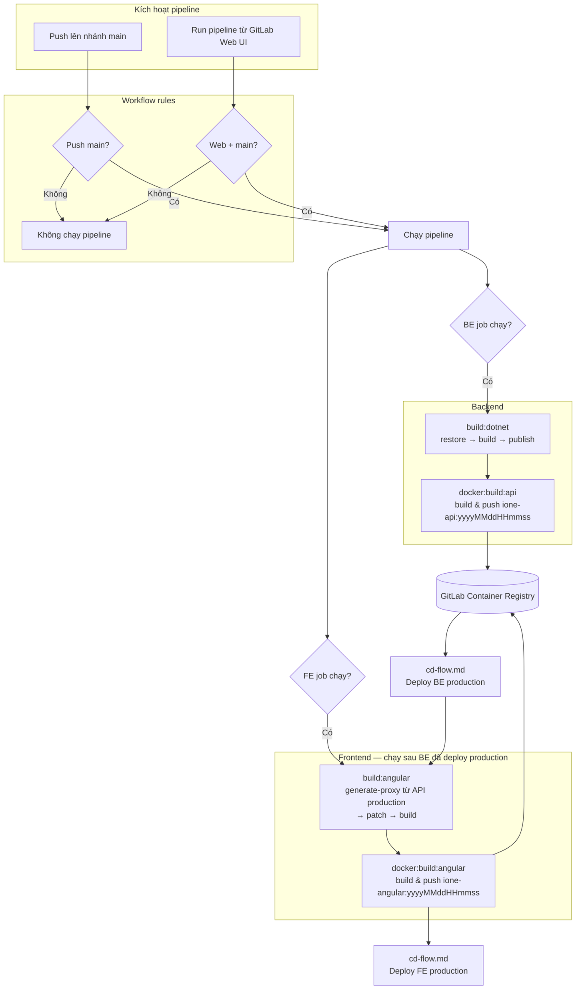

# CI Flow — iOne Core

> **Liên quan:** Phần deploy production (CD) được mô tả riêng tại [cd-flow.md](./cd-flow.md).

## 1. Mục đích tài liệu

Tài liệu này mô tả quy trình **Continuous Integration (CI)** của dự án **iOne Core** trên GitLab, gồm:

- Luồng build Backend (.NET) và Frontend (Angular) từ mã nguồn đến Docker image trên registry.
- Quy tắc kích hoạt pipeline (trigger rules).
- Cách vận hành hàng ngày và hướng mở rộng phần CI.

**Phạm vi CI:**

| Trong CI | Ngoài CI (xem [cd-flow.md](./cd-flow.md)) |
|---|---|
| Restore / build / publish artifact | Deploy production |
| Build & push Docker image | Chạy `deploy-be.sh` / `deploy-fe.sh` trên cụm app ([cd-flow.md](./cd-flow.md)) |
| Cache dependency (NuGet, Yarn) | Cấu hình biến môi trường production |

**File cấu hình liên quan:**

- `.gitlab-ci.yml` — entry point, workflow và biến `BUILD_TYPE`
- `ci/.gitlab-ci-be.yml` — pipeline Backend
- `ci/.gitlab-ci-fe.yml` — pipeline Frontend

---

## 2. Luồng CI

### 2.1. Tổng quan

Pipeline gồm **2 stage** chung cho cả BE và FE:

```
build  →  docker
```

- **build**: biên dịch mã nguồn, tạo artifact tạm (expire 1 giờ).
- **docker**: build image từ artifact, push lên GitLab Container Registry.

**CI kết thúc tại registry.** Deploy lên server production thực hiện thủ công theo [cd-flow.md](./cd-flow.md).

### 2.2. Sơ đồ luồng



### 2.3. Luồng Backend (BE)

| Bước | Job | Image CI | Mô tả |
|---|---|---|---|
| 1 | `build:dotnet` | `mcr.microsoft.com/dotnet/sdk:9.0` | `dotnet restore` → `dotnet build` (Release) → `dotnet publish` API Host |
| 2 | `docker:build:api` | `docker:latest` + dind | Build image `ione-api`, tag `yyyyMMddHHmmss` và `buildcache`, push registry |

**Artifact:** `src/web/iOne.HttpApi.Host/bin/Release/net9.0/publish/`

**Cache:** `.nuget/packages/` (key theo `NuGet.Config`, `common.props`)

### 2.4. Luồng Frontend (FE)

| Bước | Job | Image CI | Mô tả |
|---|---|---|---|
| 1 | `build:angular` | `node:20` | `yarn install` → `yarn generate-proxy:all` (từ API production) → patch → `yarn build` (production) |
| 2 | `docker:build:angular` | `docker:latest` + dind | Build image `ione-angular`, tag `yyyyMMddHHmmss` và `buildcache`, push registry |

**Artifact:** `angular/dist/`

**Cache:** `.yarn-cache/`, `angular/node_modules/`

**Lưu ý proxy ABP:**

FE CI gọi **ABP CLI** để generate proxy — sinh code client TypeScript (service, DTO) đồng bộ với contract API backend. Proxy được lấy từ **API production**:

```
https://api.ibds.com.vn/api/<module>/api-definition
```

**Thứ tự bắt buộc khi có thay đổi API backend:**

1. **CI BE** — build & push image `ione-api` (BUILD_TYPE=`BE` hoặc push `main` chỉ BE).
2. **Deploy BE production** — theo [cd-flow.md](./cd-flow.md), để production có code BE mới nhất.
3. **Retry CI FE** — BUILD_TYPE=`FE`: job `build:angular` runner chạy `yarn generate-proxy:all` với API production vừa deploy, rồi `yarn fix-proxy-patches` và build.

Nếu chạy CI FE **trước khi** BE mới lên production, bước generate proxy sẽ fail (`[API Not Available]`) hoặc sinh proxy **lệch** với code BE hiện tại.

**Trong job FE CI (tóm tắt):**

```bash
export ABP_HOST=https://api.ibds.com.vn
yarn generate-proxy:all    # abp generate-proxy -t ng -u $ABP_HOST -m <module>
yarn fix-proxy-patches     # patch bổ sung sau generate
yarn build --configuration production
```

**Khi nào cần quy trình BE → deploy → retry FE?**

- Đổi DTO, endpoint, module API backend.
- Thêm/xóa AppService exposed qua HTTP API.

Chỉ đổi UI Angular, không đổi contract API → có thể chạy CI FE (`BUILD_TYPE=FE`) mà không cần deploy BE trước.

### 2.5. Output sau CI — Docker image tag

Khi job **docker** thành công, image được push với tag theo **thời gian build** (format `yyyyMMddHHmmss`), sinh tại runtime:

```bash
export DOCKER_IMAGE_TAG="$(date +%Y%m%d%H%M%S)"
# Ví dụ: 20260722181630
```

| Image | Tag | Ghi chú |
|---|---|---|
| `ione-api:<TAG>` | `yyyyMMddHHmmss` | Sinh trong job `docker:build:api` |
| `ione-api:buildcache` | cố định | Layer cache, không dùng để deploy |
| `ione-angular:<TAG>` | `yyyyMMddHHmmss` | Sinh trong job `docker:build:angular` |
| `ione-angular:buildcache` | cố định | Layer cache, không dùng để deploy |

**Lấy tag để deploy:** mở log job docker tương ứng trên GitLab, tìm dòng:

```
DOCKER_IMAGE_TAG=20260722181630
```

BE và FE **có thể có tag khác nhau** nếu build ở hai thời điểm khác nhau (vd. retry FE sau khi deploy BE). Ghi lại đúng tag từng job trước khi deploy — xem [cd-flow.md §3.3](./cd-flow.md).

Bước tiếp theo: deploy image lên production — xem [cd-flow.md](./cd-flow.md).

---

## 3. Quy tắc kích hoạt (Trigger rules)

### 3.1. Workflow (`.gitlab-ci.yml`)

Pipeline **chỉ chạy** khi:

| Điều kiện | Mô tả |
|---|---|
| Push lên nhánh `main` | Tự động chạy **cả BE và FE** |
| Run pipeline từ Web UI trên nhánh `main` | Chạy có chọn lọc theo `BUILD_TYPE` |

Mọi trường hợp khác (feature branch, MR, tag, …) → **pipeline bị bỏ qua** (`when: never`).

### 3.2. Job rules — Push lên `main`

Khi `CI_PIPELINE_SOURCE == "push"` và `CI_COMMIT_BRANCH == "main"`:

- `build:dotnet` + `docker:build:api` → **chạy**
- `build:angular` + `docker:build:angular` → **chạy**

→ Push main = build song song BE + FE.

### 3.3. Job rules — Run pipeline từ Web UI

Khi `CI_PIPELINE_SOURCE == "web"` và nhánh `main`, chọn biến **`BUILD_TYPE`**:

| BUILD_TYPE | Backend | Frontend |
|---|---|---|
| `BE` | ✅ | ❌ |
| `FE` | ❌ | ✅ |
| `ALL` | ✅ | ✅ |
| *(để trống / null)* | ✅ | ✅ |

Giá trị mặc định khi mở form Run pipeline: **`BE`**.

### 3.4. Biến CI quan trọng

| Biến | Nguồn | Dùng cho |
|---|---|---|
| `CI_REGISTRY` | GitLab (built-in) | Host registry |
| `CI_REGISTRY_USER` | GitLab CI/CD Variables | Login registry |
| `CI_REGISTRY_PASSWORD` | GitLab CI/CD Variables | Login registry |
| `CI_COMMIT_SHORT_SHA` | GitLab (built-in) | Trace commit trong pipeline (không dùng làm image tag) |
| `BUILD_TYPE` | Form Run pipeline | Chọn BE / FE / ALL |
| `DOCKER_IMAGE_TAG` | `date +%Y%m%d%H%M%S` tại job docker | Tag image push lên registry |

---

## 4. Cách sử dụng và phát triển tiếp

### 4.1. Quy trình phát triển hàng ngày

**Developer:**

1. Làm việc trên feature branch (pipeline **không** chạy tự động).
2. Merge vào `main`.

**Khi có thay đổi API backend (DTO, endpoint, module):**

1. Push `main` hoặc Run pipeline với **`BUILD_TYPE=BE`** → chờ CI BE pass.
2. Deploy BE production theo [cd-flow.md](./cd-flow.md).
3. Run pipeline **`BUILD_TYPE=FE`** (retry FE) → CI generate proxy từ API production mới → build & push `ione-angular`.
4. Deploy FE production theo [cd-flow.md](./cd-flow.md).

**Khi chỉ thay đổi FE (không đổi contract API):**

1. Run pipeline **`BUILD_TYPE=FE`** (hoặc push `main` nếu chỉ cần FE).
2. Deploy FE production theo [cd-flow.md](./cd-flow.md).

**Lấy tag để deploy:** xem log job `docker:build:api` / `docker:build:angular` → copy giá trị `DOCKER_IMAGE_TAG` (vd. `20260722181630`). BE và FE có thể khác tag nếu build/retry ở các lần chạy pipeline khác nhau.

### 4.2. Chạy pipeline thủ công (chỉ BE hoặc chỉ FE)

1. Vào GitLab → **CI/CD → Pipelines → Run pipeline**
2. Chọn nhánh **`main`**
3. Đặt **`BUILD_TYPE`**: `BE`, `FE`, hoặc `ALL`
4. Run pipeline

Dùng khi:

- Chỉ cần rebuild API sau hotfix backend (`BE`).
- Sau khi deploy BE production, **retry FE** để generate proxy mới (`FE`).
- Chỉ cần rebuild Angular sau thay đổi UI, không đổi API (`FE`).
- Tránh build phần không liên quan để tiết kiệm thời gian runner.

**Lưu ý:** Push `main` chạy **song song** BE + FE. Nếu commit có thay đổi API, job FE có thể fail cho đến khi BE đã deploy production và retry FE.

### 4.3. Xử lý lỗi CI thường gặp

| Lỗi | Nguyên nhân | Cách xử lý |
|---|---|---|
| `[API Not Available] ... api-definition` | BE chưa deploy production, hoặc runner không reach được `api.ibds.com.vn` | Deploy BE trước ([cd-flow.md](./cd-flow.md)), rồi retry CI FE; kiểm tra network runner |
| `generate-proxy.json not found` | Lần generate proxy đầu chưa thành công | Deploy BE → retry FE; kiểm tra API production trả về `/api/abp/api-definition` |
| Docker login failed | Thiếu/sai `CI_REGISTRY_USER` / `CI_REGISTRY_PASSWORD` | Cấu hình lại GitLab CI/CD Variables |
| `dotnet build` failed | Lỗi compile backend | Fix code, push lại |
| `yarn build` failed | Proxy lệch API / lỗi TypeScript sau generate | Deploy BE mới → retry FE; kiểm tra `yarn fix-proxy-patches` |

> Lỗi liên quan deploy / pull image trên server: xem [cd-flow.md](./cd-flow.md).

### 4.4. Hướng phát triển CI tiếp theo

Các hạng mục có thể mở rộng (chưa có trong pipeline hiện tại):

1. **Pipeline cho feature branch / MR**
   - Chạy build + test, không push image production.
   - Bảo vệ `main` bằng required pipeline pass trước merge.

2. **Stage test**
   - Backend: unit test / integration test (`dotnet test`).
   - Frontend: lint, unit test (`yarn test` / `ng test`).

3. **Environment preview**
   - Mỗi MR tạo preview URL (review app).

4. **Health check trước generate proxy**
   - Job FE kiểm tra `GET /api/abp/api-definition` trước khi chạy `generate-proxy:all`, fail sớm nếu BE production chưa sẵn sàng.

5. **Security & quality**
   - SAST, dependency scanning, container scanning trên image vừa build.

6. **Notification**
   - Slack / email khi pipeline fail trên `main`.

> Hướng phát triển CD (deploy tự động, staging, …): xem [cd-flow.md](./cd-flow.md).

### 4.5. Checklist trước khi merge `main`

- [ ] Backend build local: `dotnet build iOne.sln -c Release`
- [ ] Frontend build local: `cd angular && yarn build --configuration production`
- [ ] Nếu đổi API contract: đã lên kế hoạch **CI BE → deploy BE → retry CI FE**
- [ ] Không commit secret (.env, credentials) vào repo
- [ ] Sau merge: CI BE pass → deploy BE ([cd-flow.md](./cd-flow.md)) → retry CI FE nếu cần → deploy FE

---

## Phụ lục — Cấu trúc file CI

```
ione-core/
├── .gitlab-ci.yml              # Workflow + include BE/FE
├── ci/
│   ├── .gitlab-ci-be.yml       # build:dotnet, docker:build:api
│   └── .gitlab-ci-fe.yml       # build:angular, docker:build:angular
├── angular/
│   ├── Dockerfile
│   └── src/app/proxy/          # Proxy ABP (generate trong CI FE từ API production)
└── src/web/iOne.HttpApi.Host/
    └── Dockerfile
```
